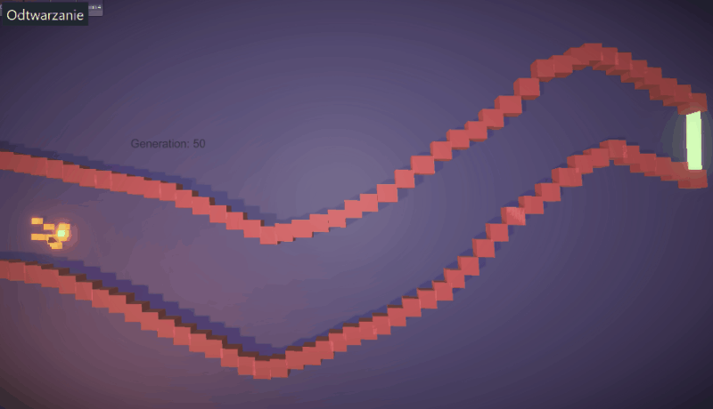
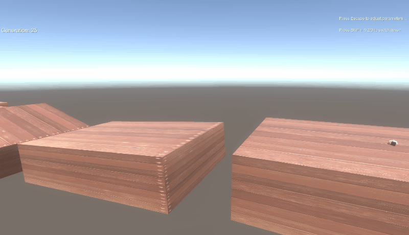
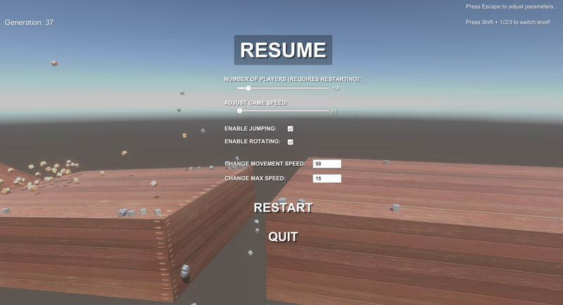

# EvOLuTIoN
Evolutionary pathfinding in Unity using Genetic Algorithm







# Download
Unity game build:
https://github.com/hobogalaxy/EvOLuTIoN/releases/download/v1.0/GenAlgBuild.zip

<br>


# How Does It Work

Each cube spawns with an instance of `Player.cs` script that contains his array of 3D vectors. Those vectors are applied to player as forces over time.


The genetic algorithm optimises those vectors.


*What it means is players don't learn how to navigate in the environment, they only memorise the vectors that enable them to get closer to the goal.*


You can find the algorithm scripts in [`Assets>>Scripts>>AlgorithmScripts`](https://github.com/hobogalaxy/EvOLuTIoN/tree/master/Assets/Scripts/AlgorithmScripts)


`Population.cs` contains the Genetic Algorithm applied by NaturalSelection() function.

```Csharp

    void NaturalSelection()
    {
        SetChampion();  //finds the best player from generation

        CalculateFitness();
        CalculateFitnessSum();  //needed for selecting parents

        CopyBrain(Players[0], champion);   //best player is always reborn in next generation unchanged as player0

        for (int i = 1; i < playerNum; i++)
        {
            GameObject parent = SelectParent();
            CopyBrain(Players[i], parent);
            Mutate(Players[i]);
        }
        
    }
```

Each player has only one parent, no crossover is used.

## Other mechanics:
- The green cube is the best player from previous generation, which is always reborn without any mutations
- Incremental learning is applied, which means each player has a certain lifespan which is increased each 5 generations. This is to give them time to master their first moves before moving on to the next ones.
- When the first player reaches the goal, the minStep variable is assigned which is the minimum of steps he needed to take to reach the goal. From now on, if any player takes more steps then minStep, he will die. This makes them optimise their way so they get to the goal faster each generation.
- The jumping is enabled just by giving players the abilty to have vectors mutated on Y axis (they're mutated only on X and Z by default).


<br>
